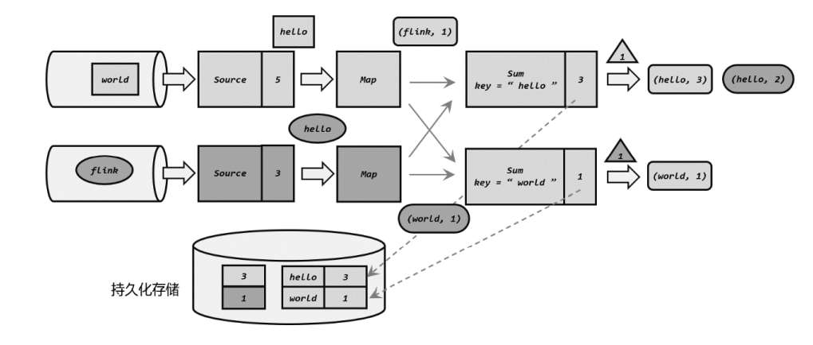

# CheckPoint检查点

## 1. checkpoint的问题

### checkpoint只能保证kafka的至少一次，无法保证不会重复消费

如果保存检查点之后又处理了一些数据，然后发生了故障，那么重启恢复状态之后这些数 据带来的状态改变会丢失。为了让最终处理结果正确，我们还需要让源（Source）算子重新读 取这些数据，再次处理一遍。这就需要流的数据源具有“数据重放”的能力，一个典型的例子 就是 Kafka，我们可以通过保存消费数据的偏移量、故障重启后重新提交来实现数据的重放。 **这是对“至少一次”（at least once）**状态一致性的保证，如果希望实现“**精确一次”（exactly once） 的一致性，还需要数据写入外部系统时的相关保证**。

## 2. checkpoint的机制

1. Job Manager发送checkpoint barrier（我们可以理解为是一个指令穿插在数据流中）
2. source收到barrier指令，开始保存现在的状态
3. source完成snapshot的快照后将barrier发送给下游，然后source继续开始读取数据
4. 下游会等到上游的barrier都到齐了才会继续传送barrier，例如如果source1的barrier到了而source2的barrier没到就需要等待。如果这个时候source1有新的数据到来，那么我们就不处理，因为这个时候就已经不属于这个snapshot的数据了，而只要source2的barrier没到，source2的数据就需要处理。
5. 等到所有的上游任务的barrier全部到达，就会进行checkpoint的保存，然后发送barrier到下游。
