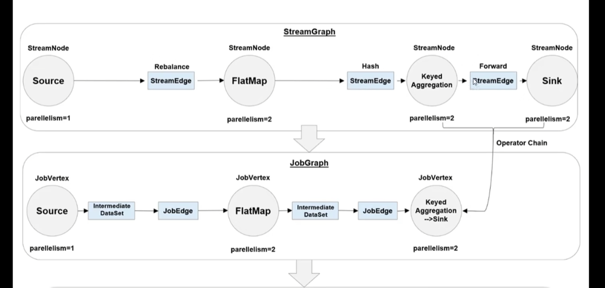
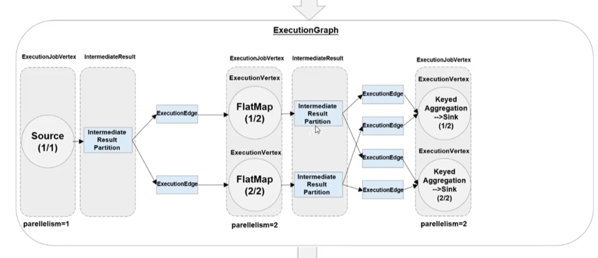

# Flink运行架构

## Flink执行任务的流程

1. Flink在客户端 会把执行的代码转化为一个**数据流图**
2. Job Manager拿到数据流图之后会把它转化成真正的**执行图，Job Manager向Resource Manager发出请求，申请任务执行的必要资源。**一旦他获得足够的资源就会把任务分发到真正运行他们的Task Manager上面
3. Task Manager里面有任务槽，任务槽（Task Slot）是最小的任务执行单位，包含一组CPU和内存资源
4. Job Manager和Task Manager之间有Task状态，心跳，监控统计，**同时Job Manager会进行checkpoints的协调**
5. Task Manager和Task Manager之间有数据流的传递，可以互相交换数据

## 数据流图和执行图的区别

首先有了数据流图之后，flink会把具有相同并行度且不会进行shuffle操作的流程图进行合并。例如上面的Keyed Aggregation 和 sink是一个直传而不是会互相重新传递数据，所以是可以合并的。

而真正的执行图就是这样的展开的任务图，Task Manager拿到这个图就知道如何进行任务。

## 任务槽（Task Slots）

Flink中每个Task Manager都是一个JVM进程，它会在独立的线程上执行一个或者多个子任务。

我们最好配置一个Task Manager的slot数量的时候，一个核对应一个slot，这样可以保证一个CPU核心可以独立运行一个任务。

同时Slot在一个任务中可以重复利用，例如有两个子任务，一个map一个keyBy都可能在同一个slot里面进行。

