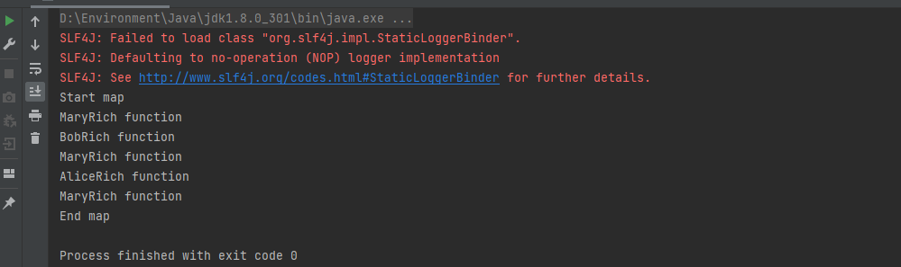

# 富函数Rich Function

## 1. 并行度设置的方法

Rich Function 有生命周期的概念。典型的生命周期方法有：

- open()方法，是 Rich Function 的初始化方法，也就是会开启一个算子的生命周期。当 一个算子的实际工作方法例如 map()或者 filter()方法被调用之前，open()会首先被调 用。所以像文件 IO 的创建，数据库连接的创建，配置文件的读取等等这样一次性的 工作，都适合在 open()方法中完成
- close()方法，是生命周期中的最后一个调用的方法，类似于解构方法。一般用来做一 些清理工作。

```java
public class RichFunctionTest {
    public static void main(String[] args) throws Exception {
        StreamExecutionEnvironment env = StreamExecutionEnvironment.getExecutionEnvironment();
        env.setParallelism(1);
        DataStreamSource<Event> eventDataStreamSource = env.fromElements(new Event("Mary", "./home", 1000L),
                new Event("Bob", "./cart", 2000L),
                new Event("Mary", "./home", 4000L),
                new Event("Alice", "./home", 3000L),
                new Event("Mary", "./home", 5000L));

        eventDataStreamSource.map(new RichMapFunction<Event, String>() {
            @Override
            public String map(Event value) throws Exception {
                return value.user + "Rich function";
            }
			// 继承AbstractRichFunction中的open方法 在启动算子的时候会使用
            @Override
            public void open(Configuration parameters) throws Exception {
                System.out.println("Start map");
            }
			// 继承AbstractRichFunction中的close方法 在结束算子的时候会使用
            @Override
            public void close() throws Exception {
                System.out.println("End map");
            }
        }).print();

        env.execute();
    }
}
```



