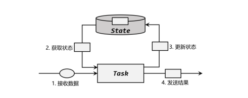

# 状态编程

[TOC]


## 1. 状态编程的概念

因为我们需要根据上下文获得流的状态，所以必须要拿到上下文。所以我们自定义的函数需要继承带

**Rich** 前缀的方法

状态既然在内存中，那么就可以认为是子任务实例 上的一个**本地变量**，能够被任务的业务逻辑访问和修改。也就是slot内或者说一个task manager拥有自己的**本地的状态**，而不是全局的状态



（1）算子任务接收到上游发来的数据； 

（2）获取当前状态； 

（3）根据业务逻辑进行计算，更新状态；

 （4）得到计算结果，输出发送到下游任务。

## 2. 按键状态编程的架构

我们定义的状态都要包装在**算子**中

```java
public static class MyFlatMapFunction extends RichFlatMapFunction<Long, String> 
{
    // 声明状态
    private transient ValueState<Long> state;
    @Override
    public void open(Configuration config) {
        // 在 open 生命周期方法中获取状态
        ValueStateDescriptor<Long> descriptor = new ValueStateDescriptor<>(
            "my state", // 状态名称
            Types.LONG // 状态类型
        );
        state = getRuntimeContext().getState(descriptor);
    }
    @Override
    public void flatMap(Long input, Collector<String> out) throws Exception {
        // 访问状态
        Long currentState = state.value();
        currentState += 1; // 状态数值加 1
        // 更新状态
        247
            state.update(currentState);
        if (currentState >= 100) {
            out.collect(“state: ” + currentState);
            state.clear(); // 清空状态
        }
    }
}
```

### 1. 值状态（ValueState）

```java
// 注册定时器，周期性输出 pv
public static class PeriodicPvResult extends 
    KeyedProcessFunction<String ,Event, String>{
    // 定义两个状态，保存当前 pv 值，以及定时器时间戳
    ValueState<Long> countState;
    ValueState<Long> timerTsState;
    @Override
    public void open(Configuration parameters) throws Exception {
        // 获得保存的状态
        countState = getRuntimeContext().getState(new 
                                                  ValueStateDescriptor<Long>("count", Long.class));
        timerTsState = getRuntimeContext().getState(new 
                                                    ValueStateDescriptor<Long>("timerTs", Long.class));
    }
    @Override
    public void processElement(Event value, Context ctx, Collector<String> out) 
        throws Exception {
        // 更新 count 值
        Long count = countState.value();
        if (count == null){
            countState.update(1L);
        } else {
            countState.update(count + 1);
        }
        // 注册定时器
        if (timerTsState.value() == null){
            ctx.timerService().registerEventTimeTimer(value.timestamp + 10 * 1000L);
            timerTsState.update(value.timestamp + 10 * 1000L);
        }
    }
    @Override
    public void onTimer(long timestamp, OnTimerContext ctx, Collector<String> 
                        out) throws Exception {
        out.collect(ctx.getCurrentKey() + " pv: " + countState.value());
        // 清空状态
        timerTsState.clear();
    }
```

### 2. 列表状态

SELECT * FROM A INNER JOIN B WHERE A.id = B.id 的转化

```java
// 创建第一个流
SingleOutputStreamOperator<Tuple3<String, String, Long>> stream1 = env.fromElements(
    Tuple3.of("a", "stream-1", 1000L),
    Tuple3.of("b", "stream-1", 2000L))
    .assignTimestampsAndWatermarks(WatermarkStrategy.<Tuple3<String, String, 																	Long>>forMonotonousTimestamps()
    .withTimestampAssigner(new SerializableTimestampAssigner<Tuple3<String, String, 																				Long>>() {
        @Override
        public long extractTimestamp(Tuple3<String, String, Long> t, long l) {
            return t.f2;
        }
    })
);
// 创建第二个流
SingleOutputStreamOperator<Tuple3<String, String, Long>> stream2 = env.fromElements(
    Tuple3.of("a", "stream-2", 3000L),
    Tuple3.of("b", "stream-2", 4000L))
    .assignTimestampsAndWatermarks(WatermarkStrategy.<Tuple3<String, String, 
														Long>>forMonotonousTimestamps()
    .withTimestampAssigner(new SerializableTimestampAssigner<Tuple3<String, String, 																				Long>>() {
        @Override
        public long extractTimestamp(Tuple3<String,String, Long> t, long l) {
            return t.f2;
        }
    })
);

// 合并两个流把id相交的提取出来
stream1.keyBy(r -> r.f0)
    .connect(stream2.keyBy(r -> r.f0))
    .process(new CoProcessFunction<Tuple3<String, String, Long>, Tuple3<String, String, 																	Long>, String>() {
        private ListState<Tuple3<String, String, Long>> stream1ListState;
        private ListState<Tuple3<String, String, Long>> stream2ListState;
        @Override
        public void open(Configuration parameters) throws Exception {
            super.open(parameters);
            // 获得第一个流的列表状态，保存着所有stream1的Tuple
            stream1ListState = getRuntimeContext().getListState(
                new ListStateDescriptor<Tuple3<String, String, 
                Long>>("stream1-list", Types.TUPLE(Types.STRING, Types.STRING)));
            // 获得第二个流的列表状态，保存着所有stream2的Tuple
            stream2ListState = getRuntimeContext().getListState(
                new ListStateDescriptor<Tuple3<String, String, 
                Long>>("stream2-list", Types.TUPLE(Types.STRING, Types.STRING))
            );
        }
        // 从ListState中拿到所有的数据，然后11比对找到相同的然后输出
        @Override
        public void processElement1(Tuple3<String, String, Long> left,
                                    Context context, Collector<String> collector) throws Exception {
            stream1ListState.add(left);
            for (Tuple3<String, String, Long> right : stream2ListState.get()) {
                if(left.f0.equals(right.f0))  collector.collect(left + " => " + right);
            }
        }
        @Override
        public void processElement2(Tuple3<String, String, Long> right,
                                    Context context, Collector<String> collector) throws Exception {
            stream2ListState.add(right);
            for (Tuple3<String, String, Long> left : stream1ListState.get()) {
                if(left.f0.equals(right.f0)) collector.collect(left + " => " + right);
            }
        }
    }).print();
	env.execute();
	}
}
```

### 3. MapState

```java
public static void main(String[] args) throws Exception {
    StreamExecutionEnvironment env = StreamExecutionEnvironment.getExecutionEnvironment();
    env.setParallelism(1);
    SingleOutputStreamOperator<Event> stream = env.addSource(new ClickSource())
        .assignTimestampsAndWatermarks(WatermarkStrategy.<Event>forMonotonousTimestamps()
        .withTimestampAssigner(new SerializableTimestampAssigner<Event>() {
           @Override
           public long extractTimestamp(Event element, long
                   recordTimestamp) {
               return element.timestamp;
           }
        }));

    // 统计每 10s 窗口内，每个 url 的 pv
    stream.keyBy(data -> data.url)
            .process(new FakeWindowResult(10000L))
            .print();
    env.execute();
}

public static class FakeWindowResult extends KeyedProcessFunction<String, Event, String> {
    // 声明状态，用 map 保存 pv 值（窗口 start，count）
    MapState<Long, Long> windowPvMapState;
    // 定义属性，窗口长度
    private Long windowSize;

    public FakeWindowResult(Long windowSize) {
        this.windowSize = windowSize;
    }

    @Override
    public void open(Configuration parameters) throws Exception {
        // 在open中获取Map状态
        windowPvMapState = getRuntimeContext().getMapState(new MapStateDescriptor<Long, Long>("window-pv", Long.class, Long.class));
    }

    @Override
    public void processElement(Event value, Context ctx, Collector<String> out)
            throws Exception {
        // 每来一条数据，就根据时间戳判断属于哪个窗口
        Long windowStart = value.timestamp / windowSize * windowSize;
        Long windowEnd = windowStart + windowSize;
        // 注册 end -1 的定时器，窗口触发计算
        ctx.timerService().registerEventTimeTimer(windowEnd - 1);
        // 更新状态中的 pv 值
        if (windowPvMapState.contains(windowStart)) {
            Long pv = windowPvMapState.get(windowStart);
            windowPvMapState.put(windowStart, pv + 1);
        } else {
            windowPvMapState.put(windowStart, 1L);
        }
    }

    // 定时器触发，直接输出统计的 pv 结果
    @Override
    public void onTimer(long timestamp, OnTimerContext ctx, Collector<String> out) throws Exception {
        Long windowEnd = timestamp + 1;
        Long windowStart = windowEnd - windowSize;
        Long pv = windowPvMapState.get(windowStart);
        out.collect("url: " + ctx.getCurrentKey()
                + " 访问量: " + pv
                + " 窗 口 ： " + new Timestamp(windowStart) + " ~ " + new
                Timestamp(windowEnd));
        // 模拟窗口的销毁，清除 map 中的 key
        windowPvMapState.remove(windowStart);
    }
}
```

### 4. Aggreation State

```java
public static void main(String[] args) throws Exception{
        StreamExecutionEnvironment env = StreamExecutionEnvironment.getExecutionEnvironment();
        env.setParallelism(1);
        SingleOutputStreamOperator<Event> stream = env.addSource(new ClickSource())
                .assignTimestampsAndWatermarks(WatermarkStrategy.<Event>forMonotonousTimestamps()
                .withTimestampAssigner(new SerializableTimestampAssigner<Event>() {
                       @Override
                       public long extractTimestamp(Event element, long
                               recordTimestamp) {
                           return element.timestamp;
                       }
                   })
                );
        // 统计每个用户的点击频次，到达 5 次就输出统计结果
        stream.keyBy(data -> data.user)
                .flatMap(new AvgTsResult())
                .print();
        env.execute();
    }
    public static class AvgTsResult extends RichFlatMapFunction<Event, String>{
        // 定义聚合状态，用来计算平均时间戳
        AggregatingState<Event, Long> avgTsAggState;
        // 定义一个值状态，用来保存当前用户访问频次
        ValueState<Long> countState;
        @Override
        public void open(Configuration parameters) throws Exception {
            // 来的数据会经过aggregationFunction聚合得到最后的结果，这里Input是Event，output是Long，中间经过AggreationState转化
            avgTsAggState = getRuntimeContext().getAggregatingState(new AggregatingStateDescriptor<Event, Tuple2<Long, Long>, Long>("avg-ts", new AggregateFunction<Event, Tuple2<Long, Long>, Long>() {
                    @Override
                    public Tuple2<Long, Long> createAccumulator() {
                        return Tuple2.of(0L, 0L);
                    }
                    @Override
                    public Tuple2<Long, Long> add(Event value, Tuple2<Long, Long> accumulator) {
                        return Tuple2.of(accumulator.f0 + value.timestamp, accumulator.f1 + 1);
                    }
                    @Override
                    public Long getResult(Tuple2<Long, Long> accumulator) {
                        return accumulator.f0 / accumulator.f1;
                    }
                    @Override
                    public Tuple2<Long, Long> merge(Tuple2<Long, Long> a, Tuple2<Long, Long> b) {
                        return null;
                    }
                }, Types.TUPLE(Types.LONG, Types.LONG)
            ));
            countState = getRuntimeContext().getState(new ValueStateDescriptor<Long>("count", Long.class));
        }
        @Override
        public void flatMap(Event value, Collector<String> out) throws Exception
        {
            Long count = countState.value();
            if (count == null){
                count = 1L;
            } else {
                count ++;
            }
            countState.update(count);
            // add方法更新accumulator里面的值
            avgTsAggState.add(value);
            // 达到 5 次就输出结果，并清空状态
            if (count == 5){
                out.collect(value.user + " 平均时间戳： " + new
                        Timestamp(avgTsAggState.get()));
                countState.clear();
            }
        }
    }
```

## 3. 算子状态

### 算子状态概念

不是按照以Key为单位做聚合 而是以任务为单位的。

算子状态的实际应用场景不如 Keyed State 多，一般用在 Source 或 Sink 等与外部系统连接 的算子上，或者完全没有 key 定义的场景。

比如 **Flink 的 Kafka 连接器中**，就用到了算子状态。 在我们给 Source 算子设置并行度后，Kafka 消费者的每一个并行实例，都会为对应的主题（topic）分区维护一个**偏移量**， **作为算子状态保存起来**。这在保证 Flink 应用“精确一次” （exactly-once）状态一致性时非常有用。

我们已经知道，状态从本质上来说就是算子并行子任务实例上的一个特殊本地变量。

- 它的 特殊之处就在于 Flink 会提供完整的管理机制，来保证它的持久化保存，以便发生故障时进行 状态恢复；

- 另外还可以针对不同的 key 保存独立的状态实例。

按键分区状态（Keyed State）对 这两个功能都要考虑；而算子状态（Operator State）并不考虑 key 的影响，所以主要任务就是 要让 Flink 了解状态的信息、将状态数据持久化后保存到外部存储空间。 看起来算子状态的使用应该更加简单才对。不过仔细思考又会发现一个问题：**我们对状态 进行持久化保存的目的是为了故障恢复；在发生故障、重启应用后，数据还会被发往之前分配 的分区吗？显然不是，因为并行度可能发生了调整，不论是按键（key）的哈希值分区，还是 直接轮询（round-robin）分区，数据分配到的分区都会发生变化。这很好理解，当打牌的人数 从 3 个增加到 4 个时，即使牌的次序不变，轮流发到每个人手里的牌也会不同。**

**对于 Keyed State 这个问题很好解决：状态都是跟 key 相关的，而相同 key 的数据不管发 往哪个分区，总是会全部进入一个分区的；于是只要将状态也按照 key 的哈希值计算出对应的 分区，进行重组分配就可以了。**

### 状态例子

#### 1. checkpoint接口

```java
public interface CheckpointedFunction {
    // 保存状态快照到检查点时，调用这个方法
    void snapshotState(FunctionSnapshotContext context) throws Exception
    // 初始化状态时调用这个方法，也会在恢复状态时调用
    void initializeState(FunctionInitializationContext context) throws Exception;
}
```

#### 2. 列表状态（ListState）

接下来我们举一个算子状态的应用案例。**自定义的 SinkFunction** 会在**CheckpointedFunctio**n 中进行数据缓存，然后统一发送到下游。这个例子演示了列表状态的平 均分割重组（event-split redistribution）。

```java
import org.apache.flink.api.common.eventtime.SerializableTimestampAssigner;
import org.apache.flink.api.common.eventtime.WatermarkStrategy;
import org.apache.flink.api.common.state.ListState;
import org.apache.flink.api.common.state.ListStateDescriptor;
import org.apache.flink.api.common.typeinfo.Types;
import org.apache.flink.runtime.state.FunctionInitializationContext;
import org.apache.flink.runtime.state.FunctionSnapshotContext;
import org.apache.flink.streaming.api.checkpoint.CheckpointedFunction;
import org.apache.flink.streaming.api.datastream.SingleOutputStreamOperator;
import org.apache.flink.streaming.api.environment.StreamExecutionEnvironment;
import org.apache.flink.streaming.api.functions.sink.SinkFunction;
import java.util.ArrayList;
import java.util.List;

public class BufferingSinkExample {
	public static void main(String[] args) throws Exception{
 		StreamExecutionEnvironment env = StreamExecutionEnvironment.getExecutionEnvironment();
 		env.setParallelism(1);
 		SingleOutputStreamOperator<Event> stream = env.addSource(new ClickSource())
 			.assignTimestampsAndWatermarks(WatermarkStrategy.<Event>forMonotonousTimestamps()
            .withTimestampAssigner(new SerializableTimestampAssigner<Event>() {
                 @Override
                 public long extractTimestamp(Event element, long recordTimestamp) {
 					return element.timestamp;
 				}
 			})
 		);

	 stream.print("input");
     // 批量缓存输出
     stream.addSink(new BufferingSink(10));
         env.execute();
	}
 	public static class BufferingSink implements SinkFunction<Event>, 		CheckpointedFunction {
        private final int threshold;
        // 当我们需要做checkpoint的时候再用到
        private ListState<Event> checkpointedState;
        // 本地变量 进行内存中缓存
        private List<Event> bufferedElements;
        
 		public BufferingSink(int threshold) {
            this.threshold = threshold;
            this.bufferedElements = new ArrayList<>();
        }
        @Override
        public void invoke(Event value, Context context) throws Exception {
            // 
            bufferedElements.add(value);
            if (bufferedElements.size() == threshold) {
                for (Event element: bufferedElements) {
                    // 输出到外部系统，这里用控制台打印模拟
                    System.out.println(element);
                }
                System.out.println("==========输出完毕=========");
                bufferedElements.clear();
            }

        }
        @Override
        public void snapshotState(FunctionSnapshotContext context) throws Exception {
            // 清除之前老的checkpoint中的数据
            checkpointedState.clear();
            // 把当前局部变量中的所有元素写入到检查点中
            for (Event element : bufferedElements) {
                checkpointedState.add(element);
            }
        }
        // 恢复的过程
        @Override
        public void initializeState(FunctionInitializationContext context) throws 
           Exception {
           ListStateDescriptor<Event> descriptor = new ListStateDescriptor<>(
                "buffered-elements",Types.POJO(Event.class));
           checkpointedState = context.getOperatorStateStore().getListState(descriptor);
           // 如果是从故障中恢复，就将 ListState 中的所有元素添加到局部变量中
           if (context.isRestored()) {
               for (Event element : checkpointedState.get()) {
                   bufferedElements.add(element);
               }
           }
        }
    }
}

```

