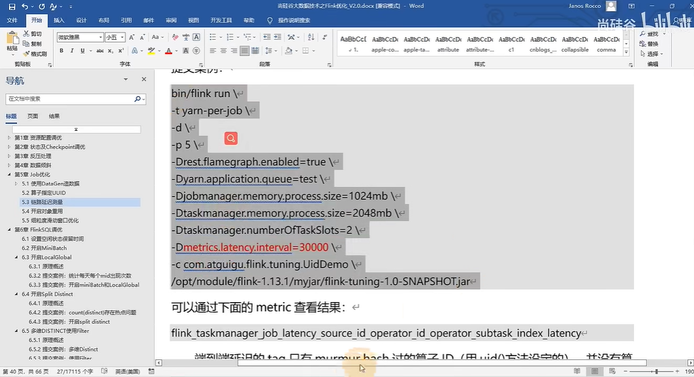

# 10-链路延迟测量

[TOC]

## 1. LatencyMarker

LatencyMarker和watermarker类似，具有一个特殊标记，采用的是process time 用来统计链路延迟

- single：每个单独算子统计自己的延迟
- operator（默认）：每个算子统计自己与source的延迟
- subtask：每个下游算子的sub-task都统计自己与source算子的sub-task之间的延迟

### 例子：加参数，30000ms代表测量延迟的时间间隔

### 
