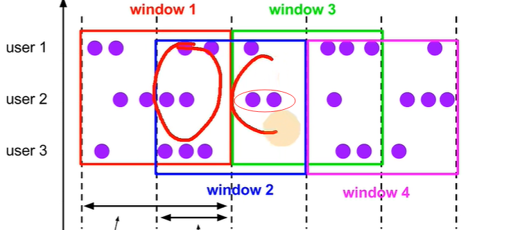
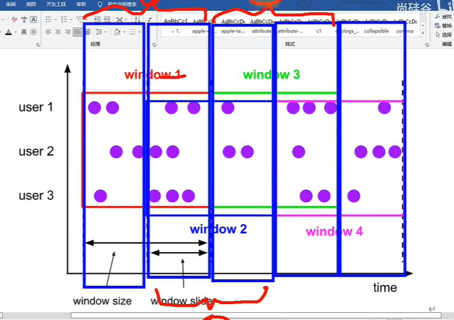

# 12-细粒度窗口优化

[TOC]

## 1.  滑动窗口优化

### 1. 以3分钟的频率实时计算近24小时的数据

这样会导致，因为窗口步长很小，但是窗口长度很大，导致同一条数据会多次出现在多个窗口中，例如这个例子中 24*60/3 = 480 : 代表最中间的那个数据会被480个窗口计算。

### 2. 解决办法

#### (1). 采用滚动窗口进行时间分片

第二个滑动窗口 = 第一个滑动窗口 - 第一个滚动窗口 + 第二个滑动窗口所包含的最后一个滚动窗口

通过滚动窗口来获得两个滑动窗口中的变量来进行解决

