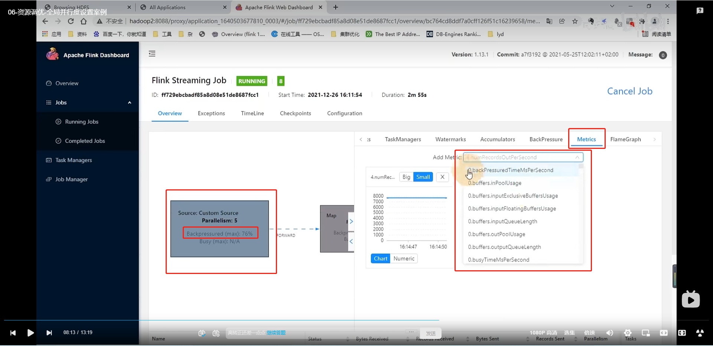

# 并行度设置

[TOC]


## 1. 并行度设置的方式

```yaml
并行度:
	配置文件: 默认并行度
	提交参数: 在submit任务的地方提交参数
	代码: env环境设置;
    	 算子设置并行度
```


## 2. 全局并行度计算

开发完成后，先进行**压测**（在kafka中积压数据，然后开启Flink任务（先设置并行度<10），出现反压之后，看单个并行度处理的能力）。

然后 并行度 = 总qps(预估的) / 但并行度的处理能力。最好再预估一下 **乘个1.2**

### 1. 全局并行度计算例子



1. 我们只看source，**因为flink的反压调整会动态调整source读数据的效率，这里我们看到Backpressured到达76%，算是比较高了**
2. 点击source这个bloc看到Metrics里面找到 numRecordsOutPerSecond，可以找到source每秒钟Out的量级可以确定出来每秒单个并行度所能处理的数据量

### 2. Kafka的source的并行度设置

如果前面是kafka

直接 **并行度 = kafka的分区数** 就行

### 3. KeyBy之后的算子的并行度设置

KeyBy之前的算子：保持和source的一样，因为基本上都是map, fliter等等onetoone的操作

KeyBy之后的算子：如果并发较大，建议设置为并行度为2的整数次幂 例如：128，256，512

### 4. sink端的并行度设置

下游是kafka就设置成分区数，如果是别的就具体问题具体分析