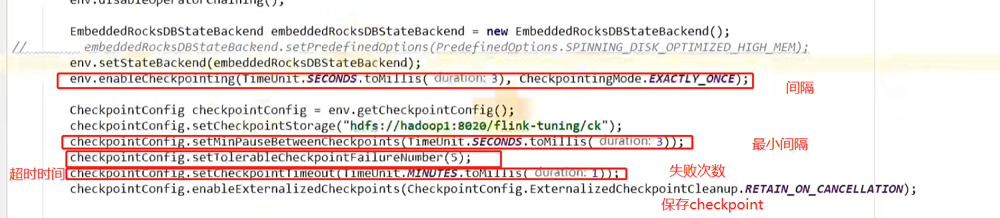
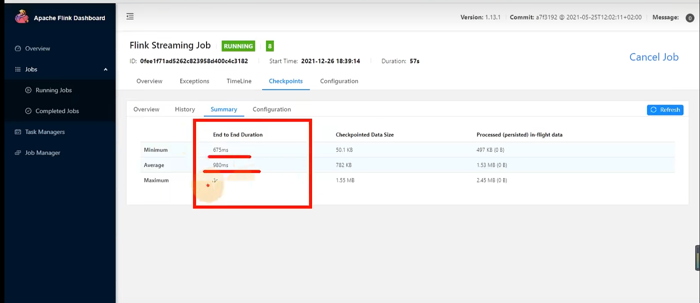

# 状态以及checkpoint调优

[TOC]

## 1. Checkpoint设置

1. 一般需求，我们checkpoint设置为分钟级别（1 - 5分钟）
2. 如果需要考虑时效性，比如我们在sink的时候通常采用**事务或者两阶段提交**，**第二次提交要求等待checkpoint完成之后**，才可以被写入到数据库。所以如果这个时候我们还是设置为分钟级别，会导致下游任务积压，所以最好我们采用秒级

### 设置的参数

1. 间隔：分钟或者秒
2. 最小等待间隔：**如果间隔过于短，有可能上一个checkpoint还没有完成，下一次checkpoint就开始了**，所以可以设置最小等待间隔，保证了即使barrier到来的时候上个checkpoint还没有完成，这个barrier也不会触发checkpoint，直到满足了上一个checkpoint的结束和下一次的开始为最小等待间隔，**一般设置为正常间隔的一半**
3. 超时时间：默认10分钟
4. 失败次数：允许失败次数
5. 保留CK：当我们手动cancel作业的时候，会删除hdfs上面的checkpoint。所以保留Checkpoint之后可以通过checkpoint恢复

****

#### 查看checkpoint端到端（完成checkpoint所需要的时间）的时间

