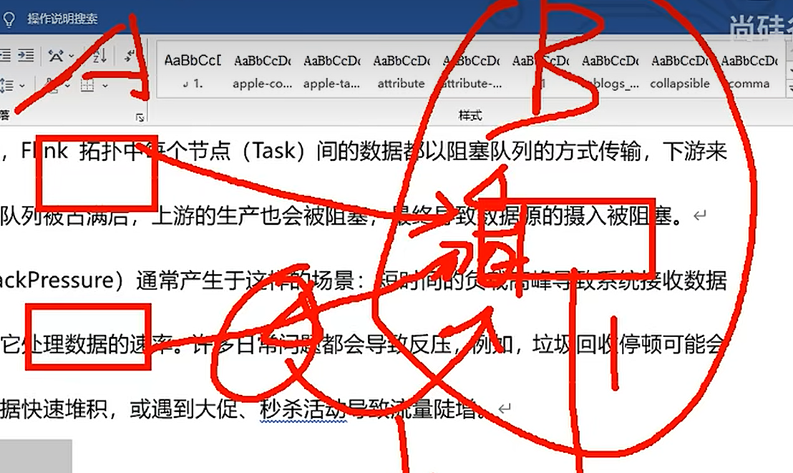
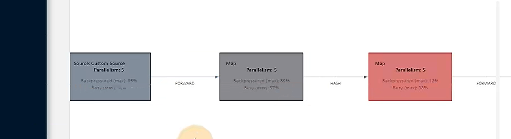
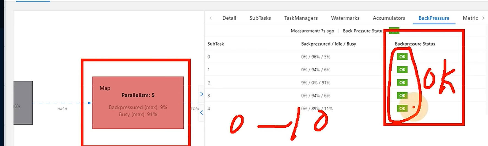
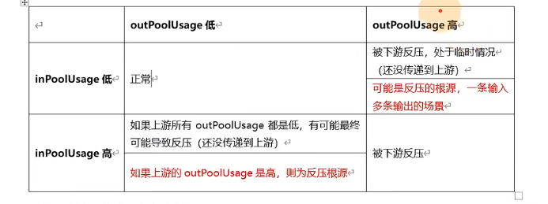
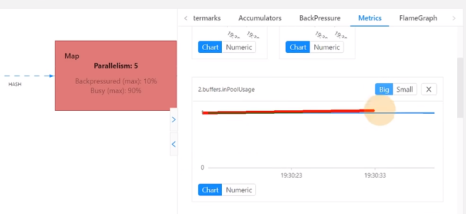
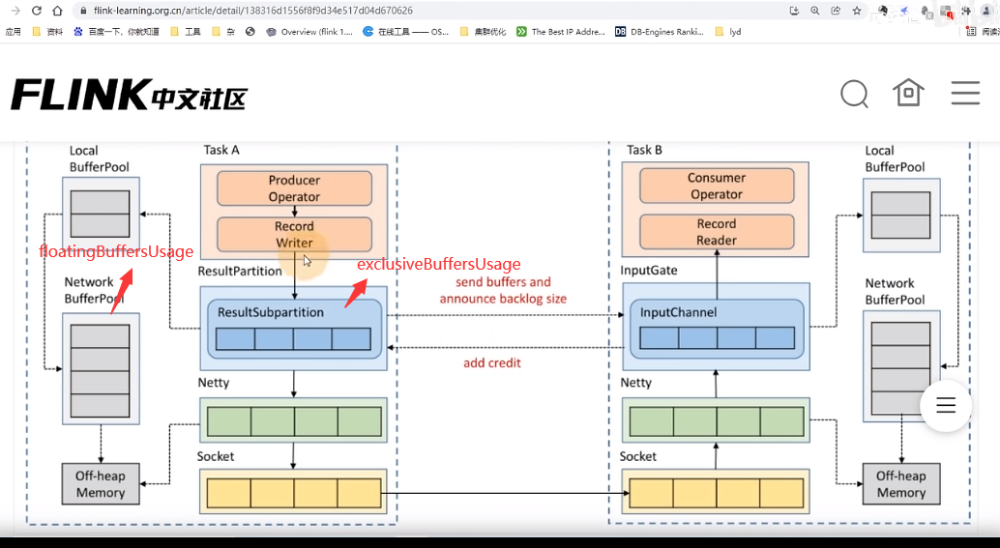
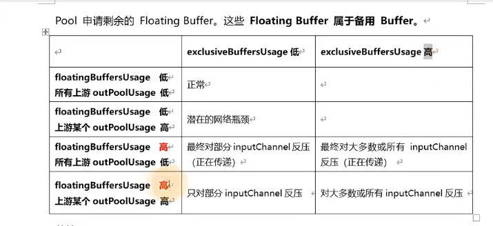
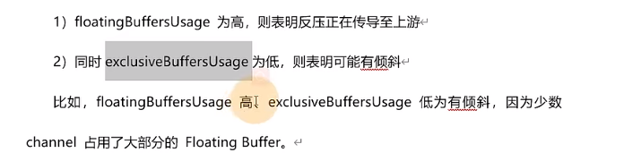

# 4. 反压及处理方法

[TOC]

## 1. 反压过程

之前采用TCP-based的反压过程，现在采用credit-based。credit-based是下游算子根据自身的缓冲区去通知上游自己还可以接收多少数据，相比于TCP-based的反压过程来讲，反应的速度更加的快。（具体看之前总结的文件）

## 2. 反压的危害

会影响到checkpoint的时长和state的大小。

### checkpoint

上游 的barrier一直不下来，导致checkpoint一直在等待barrier到齐从而延长了checkpoint的时间



### state的大小

因为在等待barrier对齐的时候，较快到达的barrier后面的数据会被储存而不会被处理，直到较慢的输入管道的barrier也到达。但是这些被缓存的数据会被放在state里面，导致checkpoint变得很大


## 3. 用webui定位反压节点

**总结：上游反压就找第一个ok，下游反压就找第一个反压的**

### 1. 取消操作链 

因为操作链会把能在同一个slot内运行的算子合并到一起，**在webui上面就会被合并，但是为了我们可以精确的定位到问题算子**，我们需要用下面代码来disable这个操作链

```java
env.disableOperatorChaining()
```

### 2. 定位反压问题

#### (1). 一般情况 反 => 反 => OK => OK



我们可以看到source和第一个map都出现反压，他们的backpressured到达了80%多（小于10%是OK，10%到50%是LOW，大于50%就是HIGH），**所以可以定位到问题一般是第三个算子的问题，因为是第三个算子的处理能力不够才导致的前面两个算子的反压情况严重**

所以一般第一个OK的算子是问题算子（可以点bloc然后点BackPressure来确定是哪里出现了问题）



#### (2). Flatmap导致的反压 OK => OK => 反 => 反

如果第一个算子是flatmap，他是一进多出，一条数据进来出去100条，就会导致让下游数据大大膨胀，导致了数据的反压。所以问题出在最后一个OK算子。

## 4. 用Metric来定位反压点



#### 1. inPoolUsage

inPoolUsage是输入缓冲区，他一直是1代表输入缓冲区一直是100%，所以可以判断出是上游结果没有被及时消费导致的。

#### 2. outPoolUsage

outPoolUsage是输出缓冲区，对于我们这种情况输出缓冲区的压力应该不大

### 1. 反 => 反 => OK => OK

对于这种情况第一个OK是问题的所在，他的处理能力的不足导致了前面的算子的输出结果不断堆积无法被第一个OK算子所消费所以造成的反压



### 2. OK => OK => 反 => 反

与上面情况相反，是输入低输出高，问题出在最后一个OK算子

### 3. Flink1.9之后的进一步Metric



#### exclusiveBuffersUsage

是算子所运行实例的缓冲区，当他满了的时候就会向Network BufferPool(每个Task都有)请求资源（Task Manager共用）。所以对于Network BufferPool来说有可能是由多个Task所共用的。

#### floatingBuffersUsage

被Task Manager所共用

#### 总结



