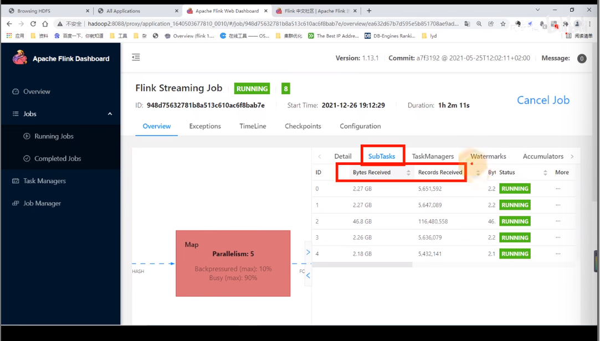

# 5. 反压的处理

[TOC]

## 1.  判断是否是因为数据倾斜导致

通过webui中bloc的subTasks的数据接收来判断是否出现数据倾斜。这里面subTask2 明显高于其他的子任务

## 2. 火焰图判断(感觉没啥用)

看最上面一层，哪个长度长就代表哪个耗费的时间多

## 3. GC情况判断

### 1. 在提交参数中加入GC细节的参数

### 2. 在webui里面查看TaskManager日志

#### (1). 下载GC日志

#### (2). GCViewer导入上面下载的日志

gcViewer是个日志查看器，可以在github上下载，然后open上面下载的日志，就可以分析出来内存和GC情况

#### (3). 如果是内存不足导致频繁GC，这里有重新设置堆内存的配置

## 4. 外部系统性能不足

### 1. 异步io + 热缓存来优化读写性能

采用连接池或者线程池读写，采用redis缓存热数据

### 2. 先攒批再读写

### 3. 面对需要读维度表join的任务

可以参考下面两个文章

