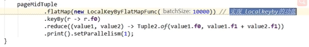
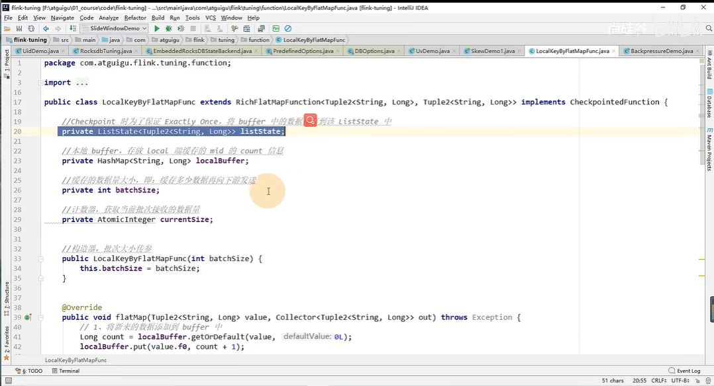
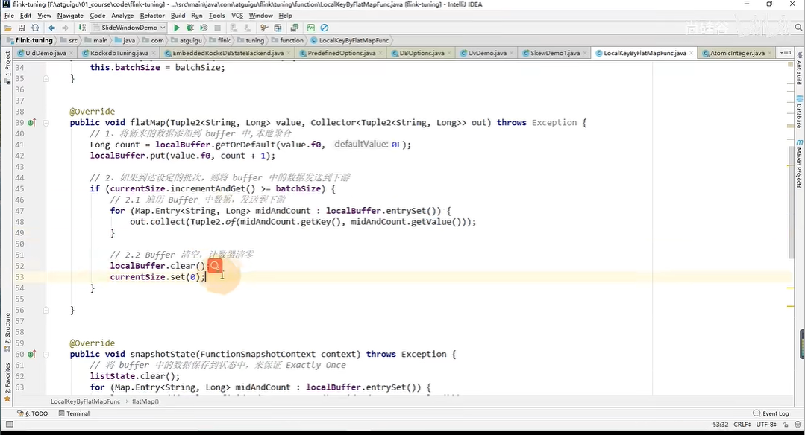
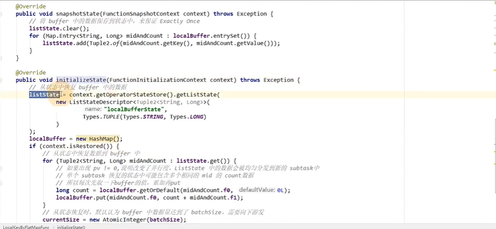
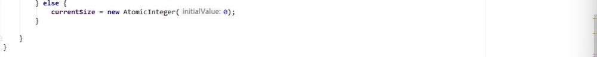
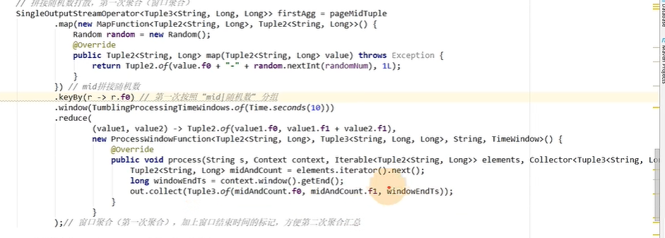
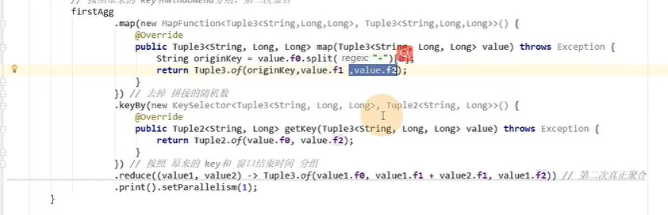

# 7-Flink数据倾斜的处理

[TOC]

## 1. LocalKeyBy思想

在keyby之前先进行预聚合

### 通过FlatMap实现预聚合



#### (1) 为了保存存储的批数据我们要采用State状态去保存数据 



#### (2) 如果批次条数达到设置的值就out.collect出来



#### (3) 重写CheckpointedFunction接口的方法实现Checkpoint的记录





## 2. Keyby之前的数据倾斜

由于  Kakfa中不同**partition的数据数量不一致，或者partition数量和消费者数量**不同导致的每个消费者拿到的数据不同造成了数据倾斜。所以就在keyby之前直接shuffle或者rebalance一下就行了。

## 3. Keyby后的窗口聚合操作存在的数据倾斜

### 采用先把key加一个随机数先预聚合然后再窗口聚合

#### 第一阶段：先在key的后面加一个随机数，然后在窗口内聚合

在数据后面加上windowEnd来帮助第二阶段的keyby



#### 第二阶段：二次聚合



### Sql版本

```sql
select winEnd,split_index(plat1,'_',0) as plat2,sum(pv) 
  from (
      select TUMBLE_END(proc_time, INTERVAL '1' MINUTE) as winEnd,plat1,count(*) as pv 
      from(
        -- 最内层，将分组的key，也就是plat加上一个随机数打散
        select plat || '_' || cast(cast(RAND()*100 as int) as string) as plat1,proc_time         from source_kafka_table 
      )
      group by TUMBLE(proc_time, INTERVAL '1' MINUTE), plat1
  ) 
  group by winEnd,split_index(plat1,'_',0)
```

