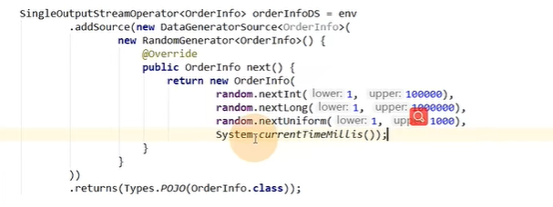
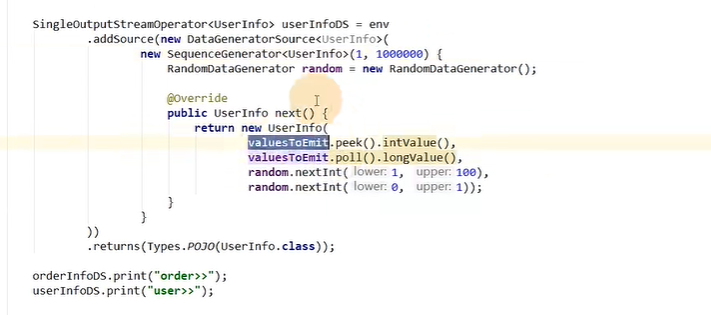
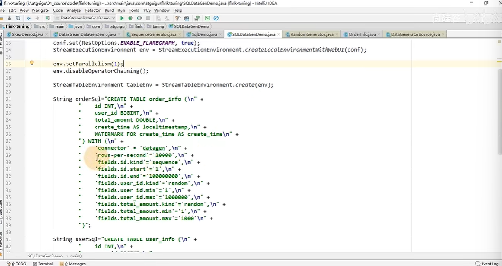
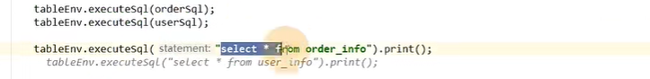

# 8-造数据便捷方法

[TOC]

## 1. 创建一个随机数据

### 使用DataGeneratorSource 重写 next方法

## 2. 创建一个序列数据

### 定义两个变量(1, 10000000)

在内部会把1 - 10000000加入到一个deque中，是一个双端队列，队列叫valuesToEmit，然后可以操作这个队列去获取序列中你想要的数据

## 3. Sql方式

- rows-per-second: 每秒钟生成的多少行

执行sql获得创建的假数据
