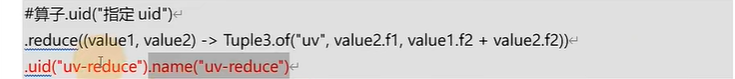
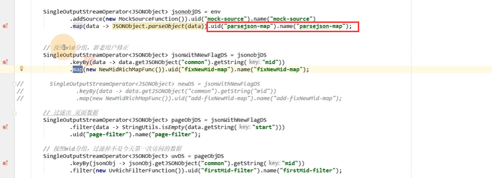
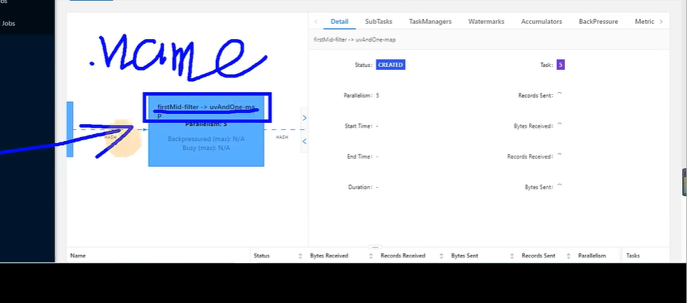

# 9-算子指定UUID

## 1. 指定UUID的原因

当更改代码的时候，**由于如果没有指定uuid，uuid重新自动生成，导致checkpoint无法对应的上**，最后任务重启失败报错

比如原来算子是 A -> B -> C，然后更改为A -> D -> B -> E，如果没有指定uuid，B的状态无法被恢复导致任务重启失败，因此：

- **建议每个算子都指定上UUID**

- uid：指定uuid
- name：给算子起个名字（没啥用，可以当作注释）

### webui的bloc名字也跟着更改

